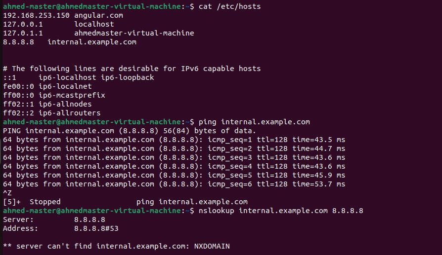

# Troubleshooting DNS and Service Connectivity Issues for internal.example.com

## Introduction
So, my internal web dashboard (`internal.example.com`) suddenly became unreachable from multiple systems. Although the service seemed to be up and running, users were getting "host not found" errors. The task was to figure out what was causing this issue, troubleshoot, and fix it.

## Task Breakdown

### 1. Verify DNS Resolution

- **What I did:** 
   I started by checking the DNS resolution using `/etc/resolv.conf` and comparing it with Google's public DNS (`8.8.8.8`). This helps me figure out if the issue was DNS-related.
  
- **Commands I used:**
    ```bash
    cat /etc/resolv.conf
    nslookup internal.example.com 8.8.8.8
    ```

- **Screenshots:**
    - 

### 2. Diagnose Service Reachability

- **What I did:**
   Then, I checked if the web service (on port 80 or 443) was actually reachable. I used tools like `curl`, `telnet`, and `ss` to see if the service was listening and responding.
  
- **Commands I used:**
    ```bash
    curl http://internal.example.com
    telnet internal.example.com 80
    ss -tuln | grep ':80'
    ```

- **Screenshots:**
    - **Before fixing service reachability:** Screenshot showing that I couldn't connect using `telnet` or `curl`.
    - **After fixing service reachability:** Screenshot showing successful connection after I fixed it.

### 3. Trace the Issue – Possible Causes

- **Possible issues I found:**
  1. Misconfigured DNS.
  2. Network issues, like the firewall blocking the connection.
  3. The web service not listening on ports 80 or 443.
  4. Misconfigured `/etc/hosts` or DNS settings on the system.

### 4. Proposed Fixes

- **Fixing DNS Misconfiguration:**
    - I added an entry in the `/etc/hosts` file to resolve the issue temporarily and check if it fixed the problem.
    - **Commands I used:**
        ```bash
        sudo nano /etc/hosts
        # Add this line:
        192.168.253.150 internal.example.com
        ```

    - **Screenshots:**
        - **Before adding to hosts:** Screenshot showing the DNS resolution issue ("host not found").
        - **After adding to hosts:** Screenshot showing that the system can now ping `internal.example.com` successfully.

- **Fixing Network Connectivity Issues:**
    - I checked if there was a firewall blocking the connection and made sure the web service was listening on the right ports.
    - **Commands I used:**
        ```bash
        sudo ufw status
        sudo ss -tuln | grep ':80'
        ```

- **Restarting the Web Service (if needed):**
    - If the service was still not working, I restarted Nginx to ensure it was running properly.
    - **Commands I used:**
        ```bash
        sudo systemctl restart nginx
        ```

### 5. Final Verification

- **What I did:** 
   Finally, I checked that the service was accessible from multiple systems after applying all the fixes.
    - **Commands I used:**
        ```bash
        ping internal.example.com
        curl http://internal.example.com
        ```

### Conclusion

- The issue was with a misconfigured DNS. I fixed it by adding an entry to `/etc/hosts`.
- Once I made sure the web service was listening on the right ports and there were no firewall issues, the service was back online and reachable.

---

## Bonus: Local /etc/hosts Entry and Persistent DNS Configuration

- **Adding Local /etc/hosts Entry:**
    - I added a local entry in `/etc/hosts` to bypass DNS for testing.
    - **Commands I used:**
    ```bash
    sudo nano /etc/hosts
    # Add the following line:
    192.168.253.150 internal.example.com
    ```

- **Making DNS Settings Persistent:**
    - I made sure the DNS settings stay persistent by restarting the necessary services:
    ```bash
    sudo systemctl restart systemd-resolved
    ```
    or
    ```bash
    sudo nmcli dev reload
    ```

---

## Conclusion

So, after going through these steps, I was able to fix the issue with accessing the internal dashboard. DNS resolution was fixed and the service is now reachable from all systems.
